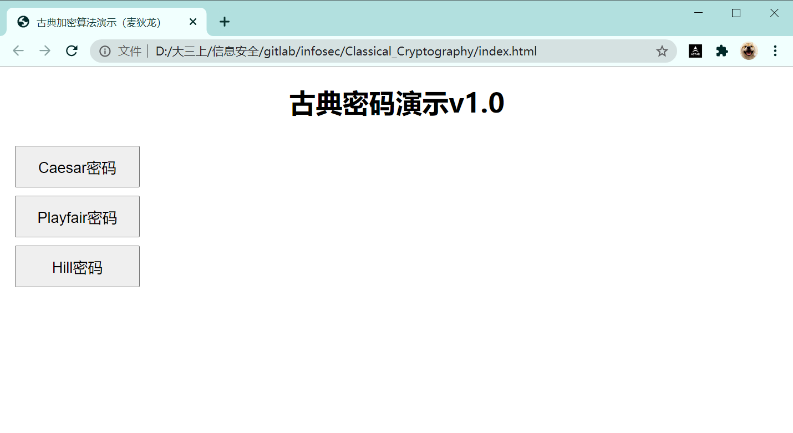
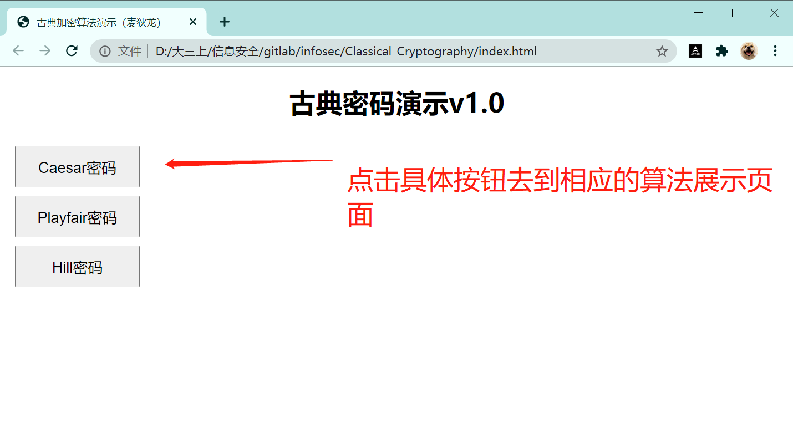

# infosec

作者：麦狄龙

起始时间：2020-11-01

主题：用于配合《信息安全概论》课程古典密码算法网页版演示

# 古典密码算法演示

# 1 用户说明

## 1.1 编程语言

可视化展示使用简单Html+CSS+Vue展示，数据交互及算法逻辑实现使用Javascript；

弱数据类型，但能基本满足整数的使用及英文字母的使用；

## 1.2 文件说明

-  

  文件夹Classical_Cryptography为代码源文件；

  文件夹renadme_images为readme的图片；

- 

  源代码文件为基本web页面，点击index.html为程序入口

## 1.3 操作流程

1. 建议使用谷歌浏览器打开index.html

   

2. 点击具体按钮到相应界面

3. 按流程输入

   

4. 错误提示

   

## 1.4 版本说明

- V1.0：完成基本的Caesar密码、Playfair密码、Hill密码的加密演示、图形界面的演示

# 2 Caesar密码

## 2.1 算法思路

对明文使用ASCII码转码后按照密钥的值进行相加，在根据ASCII码的值输出为密文

## 2.2 关键代码

```javascript
//凯撒密码算法
Caesar:function(){
    let miwen=[];
    let uppercase=/[A-Z]/;
    let lowercase=/[a-z]/;
    if(this.m_selected_K==0){
        alert("请选择密钥！")
    }
    for (var i = 0; i < this.caesarMingwen.length; i++) {
        //判断大写字母65-90
        if(uppercase.test(this.caesarMingwen[i])){
            //是否加了密钥之后跳出90
            if(this.caesarMingwen[i].charCodeAt()+this.m_selected_K>90){
                miwen.push(String.fromCharCode(65+this.caesarMingwen[i].charCodeAt()+this.m_selected_K-90-1));
            }else{
                miwen.push(String.fromCharCode(this.caesarMingwen[i].charCodeAt()+this.m_selected_K));
            }
        }else if(lowercase.test(this.caesarMingwen[i])){//判断小子字母97-122
            //是否加了密钥之后跳出122
            if(this.caesarMingwen[i].charCodeAt()+this.m_selected_K>122){
                miwen.push(String.fromCharCode(97+this.caesarMingwen[i].charCodeAt()+this.m_selected_K-122-1));
            }else{
                miwen.push(String.fromCharCode(this.caesarMingwen[i].charCodeAt()+this.m_selected_K));
            }
        }else{//非英文字母直接输出
            miwen.push(this.caesarMingwen[i]);
        }
    }
    this.caesarMiwen=miwen.join("");
}
```
## 2.3 例子演示

1. 输入明文：you are discovered save yourself

   密钥选择：3

   结果：brx duh glvfryhuhg vdyh brxuvhoi

2. 输入明文：BGM

   密钥选择：5

   结果：GLR

   

# 3 Playfair密码

## 3.1 关键代码

- 处理密钥

  ```javascript
  /*
  playfair密钥去重
  参数e：密钥
  返回：去重后的字符串e
  */
  removeDuplicate:function(e){
      var result = [];
      var temStr = "";
      var arr = e.split('');//把密钥e分割成数组
      var flag;//判断数组中是否有重复值
      for (var i = 0; i < arr.length; i++) {
          flag = true;
          //循环判断result数组里是否和当前arr[i]有重复的
          for(var j = 0;j < result.length;j++){
              if(arr[i] == result[j]){
                  flag = false;
              }
          }
          //如果是J
          if(flag && arr[i] != " "){
              if(arr[i] == "J"){
                  result.push("I");
              }else{
                  result.push(arr[i]);
              }
          }else{
              continue;
          }
      }
      return result.join("");
  }
  ```

- 明文分组两个两个为一组，不足补K，重复替换成K

  ```javascript
  /*
  playfair明文分组
  参数e：明文
  返回：按规则分组的明文group
  */
  dividePlayFairMingwen:function(e){
      var arr = e.toUpperCase().replace(/\s*/g,"").split('');//将明文去除空格后分割
      var j = 0;
      var group = new Array();
      var n = 0;
      //明文中有非字母的要求重新输入,刷新页面
      if(/^[a-zA-Z]|\s+/.test(this.playFairMingwen) != true){
          alert("明文中有除空格之外非字母出现");
          console.log("明文中有除空格之外非字母出现");
          // location.reload();
      }else {
          //把所有的J都变成I
          for (var i = 0; i < arr.length; i++) {
              if(arr[i] == "J"){
                  arr[i]='I';
              }
          }
          while(j < arr.length){
              //空格则跳到下一个
              if(arr[j] == ' '){
                  j++;
              }else{
                  //碰到数组最后一个或者遇到相同的明文字母则插入一个填充字母K
                  if(j+1 == arr.length || arr[j] == arr[j+1]){
                      group[n] = new Array();
                      group[n][0] = arr[j];
                      group[n][1] = 'K';
                      n++;
                      j++;
                  }else{
                      group[n] = new Array();
                      group[n][0] = arr[j];
                      group[n][1] = arr[j+1];
                      n++;
                      j+=2;
                  }
              }
          }
      }
      // console.log(group);
      return(group);
  
  }
  ```

- 明文加密，同行右移，同列下移，不同行不同列取其同行与下一个字母的列

  ```javascript
  /*
  playfair加密
  参数e,matrix：明文分组e(二维数组)，以及密钥矩阵matrix
  返回：加密后的密文字符串miwen
  */
  changeToPlayFairMiwen:function(e,matrix){
      // console.log(e);
      var row = new Array(e.length);//行坐标二维数组
      var col = new Array(e.length);//列坐标二维数组
      var miwen = new Array();
      var temp;
      var j=0;
      for(var z=0;z<e.length;z++){
          row[z] = new Array(2);
          col[z] = new Array(2);
      }
      //先循环读出明文分组在密码矩阵中对应的行、列
      for (var i = 0; i < e.length; i++) {
          for(var x = 0;x < 5; x++){
              for(var y = 0; y < 5; y++){
                  if(e[i][0] == matrix[x][y]){
                      row[i][0] = x;
                      col[i][0] = y;
                  }
                  if(e[i][1] == matrix[x][y]){
                      row[i][1] = x;
                      col[i][1] = y;
                  }
              }
          }
      }
  
      //明文移位
      for (var i = 0; i < e.length; i++) {
          //同行右移一位
          if(row[i][0] == row[i][1]){
              col[i][0] = (col[i][0] + 1) % 5;
              col[i][1] = (col[i][1] + 1) % 5;
          }else if(col[i][0] == col[i][1]){//同列下移一位
              row[i][0] = (row[i][0] + 1) % 5;
              row[i][1] = (row[i][1] + 1) % 5;
          }else{//不同行不同列，取其同行且与下以字母同列的字母
              temp = col[i][0];
              col[i][0] = col[i][1];
              col[i][1] = temp;
          }
      }
      //转换成密文
      for(var i = 0; i < e.length; i++){
          miwen[j++] = matrix[row[i][0]][col[i][0]];
          miwen[j++] = matrix[row[i][1]][col[i][1]];
          miwen[j++] = " ";
      }
      return miwen;
  }
  ```

- 主函数

  ```javascript
  /*
  Playfair密码算法入口
  */
  Playfair:function(){
      if(/^[a-zA-Z]+$/.test(this.playfair_k)!=true){
          alert("密钥请输入正确的字母组合，不能输入为空也不能输入数字或其他字符！")
      }
      let key = new Array();
      var mingwen;
      var miwen;
      //这里密码表处理I/J问题使用的是都当成I的策略
      let allChars = ['A','B','C','D','E','F','G','H','I','K','L','M','N','O','P','Q','R','S','T','U','V','W','X','Y','Z'];
      //将密钥转成全部大写
      let word = this.playfair_k.toUpperCase();
      //去重和把J变成I
      word = this.removeDuplicate(word);
      //保证去掉重复的I
      word = this.removeDuplicate(word);
      //变量playfair_k获取字母在字母顺序表中位置，删除该字母
      for(var i = 0 ;i<word.length;i++){
          var index = allChars.indexOf(word[i]);
          if (index > -1) {
              allChars.splice(index, 1);
          }
      }
      //将playfair_k中的字母插入到字母表中
      for(var i = word.length-1;i>=0;i--){
          allChars.unshift(word[i]);
      }
      //从第一列将playfair_k插入至密码表
      for(var i = 0 ; i<5 ; i++){
          key[i] = new Array();
          for(var j = 0; j<5 ;j++){
              key[i][j] = allChars[i*5+j];
          }
      }
      // 输出矩阵
      let l = new Array();
      for (var i = 0; i < 5; i++) {
          l[i]=key[i].join("\t");
      }
      /*
  						这里新建一个l数组非常重要，因为最后是l变成一个矩阵，再让this.letter直接
  						替换原数组，否则直接在for循环里this.letter[i]=key[i].join("\t");是不会
  						响应式显示在页面的！
  						*/
      this.letters=l;
      //明文分组
      mingwen=this.dividePlayFairMingwen(this.playFairMingwen);
      //解密
      miwen=this.changeToPlayFairMiwen(mingwen,key).join('');
      this.playFairMiwen = miwen;
  }
  ```

## 3.2 例子演示

- 明文：we are discovered save yourself
- 密钥：monarchy
- 密文：UG RM KC SX HM UF MK BT OX GC MV AT LU GE 


# 4 Hill密码

## 4.1 关键代码

- 将密文分组，三个为一组，不足三个补X，转换成大写字母

  ```javascript
  /*
  hill明文分组
  参数：e明文字符串
  返回：3个字母一组的二维数组(不足3个补x)
   */
  divedeHillMingwen:function(e){
      var group = new Array();
      var j = 0;
      if(/^[a-zA-Z]|\s+/.test(e) != true){
          alert("明文中有除空格之外非字母出现");
          console.log("明文中有除空格之外非字母出现");
      }else{
          var arr = e.toUpperCase().replace(/\s*/g,"").split('');//将明文去除空格后分割
          //不足3个补X
          while(arr.length % 3 != 0){
              arr.push('X');
          }
          //明文按3个字母分组
          for (var i = 0; i < arr.length / 3; i++) {
              group[i] = new Array(3);
              group[i][0] = arr[j++];
              group[i][1] = arr[j++];
              group[i][2] = arr[j++];
          }
          // console.log(group)
      }
      return group;
  }
  ```

- 获取密钥转换成矩阵，判断行列式是否为0，即是否可逆

  ```javascript
  /*
  获取密钥矩阵
  参数：e密钥数字字符串
  返回：密钥二维数组3X3
  */
  hillmatrix:function(e){
      var flag = true;
      var n = 0;
      var matrix = new Array();
      var arr = e.split(/\s+/);//将密钥去除空格后分割
      if(/^[0-9]|\s+/.test(arr) != true){
          var flag = false;
          alert("密钥中有除空格之外非数字出现");
          console.log("密钥中有除空格之外非数字出现");
      }else{
          if(arr[arr.length-1] == ""){
              arr.pop();
          }
          if(arr.length != 9){
              alert("密钥矩阵出错，必须为9项");
              var flag = false;
          }
          for(var i = 0;i < arr.length;i++){
              if (arr[i] >= 0 && arr[i] <=63356 && !(Math.floor(arr[i])=== arr[i])){
                  continue;
              }else{
                  var flag = false;
                  alert("必须输入小于63356的非负正整数！");
                  break;
              }
          }
          //判断矩阵行列式是否为0=>矩阵是否可逆
          if(arr[0] * arr[4] * arr[8] + 
             arr[1] * arr[5] * arr[6] + 
             arr[2] * arr[3] * arr[7] -
             arr[6] * arr[4] * arr[2] -
             arr[7] * arr[5] * arr[0] -
             arr[8] * arr[3] * arr[1] == 0){
              flag = false;
              alert("矩阵行列式为0，矩阵不可逆无法解密")
          }
          //将密钥字符串变成3X3矩阵
          if(flag != false){
              for(var j = 0;j < 3;j++){
                  matrix[j] = new Array(3);
                  matrix[j][0] = arr[n++];
                  matrix[j][1] = arr[n++];
                  matrix[j][2] = arr[n++];
              }
          }
          // console.log(matrix);
      }
      return matrix;
  }
  ```

- 将3个明文一组的向量与矩阵相乘运算，再根据字母顺序得出密文

  ```javascript
  /*
  hill明文加密
  参数：e3个字母一组的二维数组,matrix密钥矩阵
  返回：加密后的密文字符串
  */
  changeToHillMiwen:function(e,matrix){
      // console.log(e);
      // console.log(matrix);
      var m = new Array();
      var miwen = new Array();
      for (var i = 0; i < e.length; i++) {
          miwen[i] = new Array(3);
          miwen[i][0] = String.fromCharCode((matrix[0][0] * (e[i][0].charCodeAt() - 65) + 
                                             matrix[0][1] * (e[i][1].charCodeAt() - 65) + 
                                             matrix[0][2] * (e[i][2].charCodeAt() - 65)) % 26 + 65);
          miwen[i][1] = String.fromCharCode((matrix[1][0] * (e[i][0].charCodeAt() - 65) +
                                             matrix[1][1] * (e[i][1].charCodeAt() - 65) + 
                                             matrix[1][2] * (e[i][2].charCodeAt() - 65)) % 26 + 65);
          miwen[i][2] = String.fromCharCode((matrix[2][0] * (e[i][0].charCodeAt() - 65) +
                                             matrix[2][1] * (e[i][1].charCodeAt() - 65) + 
                                             matrix[2][2] * (e[i][2].charCodeAt() - 65)) % 26 + 65);
      }
      var n = 0;
      for (var i = 0; i < miwen.length; i++){
          m[n++] = miwen[i][0];
          m[n++] = miwen[i][1];
          m[n++] = miwen[i][2];
          m[n++] = " ";
      }
      // console.log(m);
      return m;
  }
  ```

- 主函数

  ```javascript
  Hill:function(){
      var miwen = new Array();
      var group;
      var matrix;
      //获取明文分组
      group = this.divedeHillMingwen(this.hillMingwen);
      //获取密钥矩阵
      matrix = this.hillmatrix(this.hill_k);
      //加密
      miwen = this.changeToHillMiwen(group,matrix).join("");
      // console.log(miwen);
      //输出密文
      this.hillMiwen = miwen;
  }
  ```

## 4.2 例子演示

明文：17 17 5 21 18 21 2 2 19

规模m：3（暂时固定）

密钥矩阵：

17   17   5 

21  18   21 

2     2    19

密文输出：LNS HDL EWM TRW 

